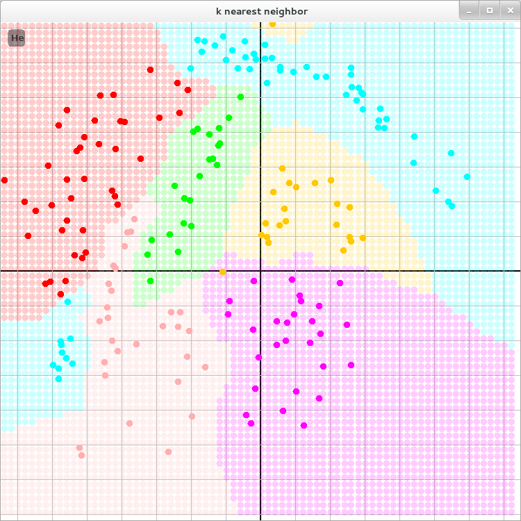

k-Nearest Neighbour
==========================

   Visualization of kNN-Classificator
   
   LICENSED under GPLv3

You can start via the `weigla.knn.KNNFrame` class in eclipse.

What you can do:

  1. Choose with 1 - 6 a label class
  2. Put features on the surface
  3. Right Mouse Click print the class nearest to the mouse (`System.out`)
  4. Press ``c`` for classify a mesh on the surface (see picture)

TODO: 
  * clear the features
  * help panel
  * adjust ``k``
  * adjust the mesh sizes and visualization
  * show distances to features from mouse pointer

